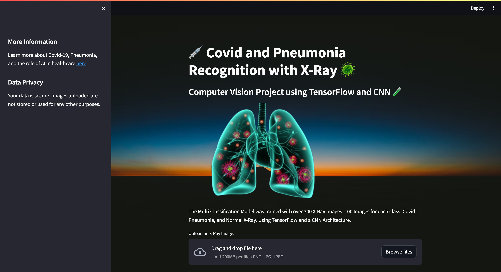
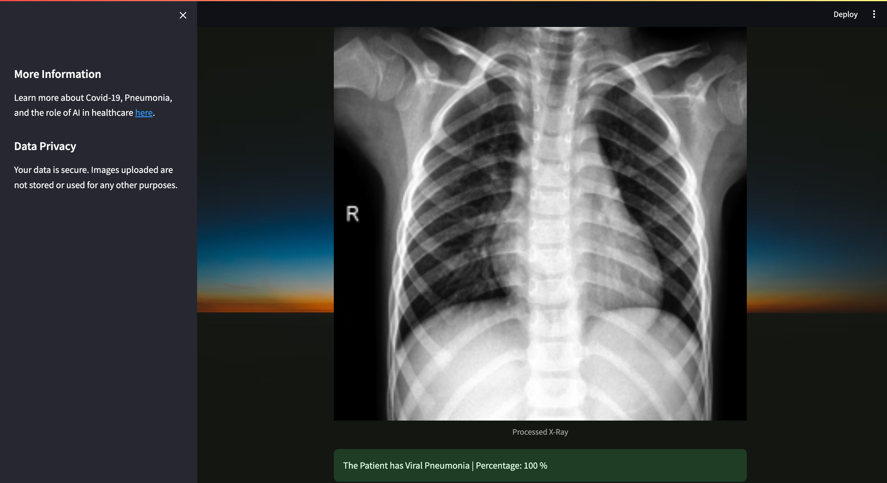

# Covid-19 and Pneumonia Recognition using X-Ray, Streamlit, CNN and TensorFlow 🦠

## Description

Covid-19 and Pneumonia Recognition is an advanced medical imaging application designed to assist in the diagnosis of Covid-19 and pneumonia using X-ray images. Leveraging the power of Convolutional Neural Networks (CNN) and TensorFlow, it offers an intuitive platform for healthcare professionals to analyze X-ray images with enhanced accuracy and efficiency.

The CNN Model, was trained with over 300 X-Ray Images, 100 Images for each class, Covid, Pneumonia and Normal X-Ray.

## Features

- **Automated Diagnosis**: Quick and automated classification of X-ray images into Covid-19, Pneumonia, or Normal.
- **User-Friendly Interface**: Built with Streamlit, ensuring a seamless user experience.
- **Advanced Image Processing**: Utilizes sophisticated image processing techniques for accurate analysis.
- **Robust Machine Learning Model**: Powered by a TensorFlow-based CNN model trained on a diverse dataset.
- **Real-Time Analysis**: Rapid processing and presentation of diagnostic results.
- **Secure and Reliable**: Implements rigorous data validation and error handling for secure usage.

## Technical Stack

- **Machine Learning Model:** TensorFlow, TensorFlow Hub
- **Frontend:** Streamlit
- **Image Processing:** OpenCV, Pillow

## Installation

### Prerequisites

- [Python](https://www.python.org/downloads/)
- [Pip](https://pip.pypa.io/en/stable/installation/)
- [Streamlit](https://streamlit.io/)

### Setup

1. Clone the repository:
   ```bash
   git clone https://github.com/VanditGupta/Covid19_Detection
   ```
2. Navigate to the project directory:
   ```bash
    cd Covid19_Detection
   ```
3. Install the dependencies:
   ```bash
   pip install -r requirements.txt
   ```
4. Run the application:
   ```bash
   streamlit run app.py
   ```
5. Open the application in your browser:
   ```bash
   http://localhost:8501/
   ```

## Usage

1. Upload an X-ray image of a patient by clicking the **Browse files** button.
2. Click on the **Analyze X-Ray** button to initiate the diagnosis.
3. View the diagnosis results.

## Screenshots



<br>



## Resources

X-Ray Dataset: https://www.kaggle.com/datasets/pranavraikokte/covid19-image-dataset

## Research Paper

This project is accompanied by a detailed research paper that delves into the methodologies, technologies, and findings associated with the Covid-19 detection. The paper provides insights into the development process, the machine learning model's architecture, the dataset used, and the results obtained.

Title: "Covid-19 Detection using Deep Learning"

The full paper can be accessed [here](http://ijmtst.com/volume6/issue12/81.IJMTST0612212.pdf).

For more detailed information and a comprehensive understanding of the project's scientific background, please refer to the research paper.

## Contributing

Contributions are welcome! Please feel free to submit a Pull Request. Please read the CONTRIBUTING.md file for more details.

## License

This project is licensed under the MIT License. Please read the LICENSE.md file for more details.

## Contact

For any inquiries or contributions, please contact me at [gupta.vandi@northeastern.edu](mailto:gupta.vandi@northeastern.edu)

## Project Status

This project is currently in active development. For the latest updates, please check our [GitHub repository](https://github.com/VanditGupta/Covid19_Detection).
